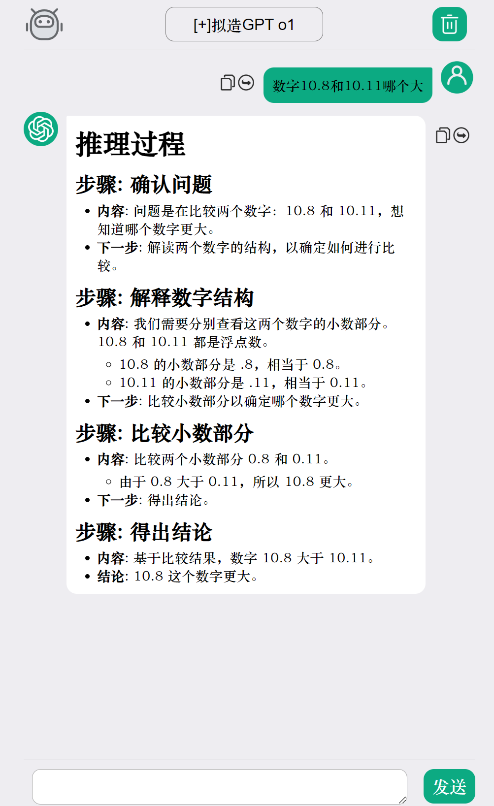

# Single-ChatGPT-Web

[](https://opensource.org/licenses/MIT)

[[中文](README.md)|English]

A lightweight single-file HTML version of ChatGPT web client, utilizing the OpenAI API for intelligent conversation features.
This page is translated using ChatGPT. Please forgive me if there is any inappropriateness.

## Features

- Simple chat interface design with support for conversational context
- Ultra-small single file of only 88KB, zero-dependency deployment (only relies on files from ByteDance CDN for rendering md and tex)
- Markdown rendering based on `marked.js` and `github-markdown.css` (ByteDance CDN)
- LaTeX formula rendering based on MathJax (ByteDance CDN)
- Uses base64-encoded images embedded in the HTML file
- Display adaptation for Deepseek deep thinking content
- Responsive layout (supports both PC and mobile access)

## Changelog

This repository was released on the GitHub platform on 2025-02-17.

**1.0**

> 2024-08-13
>
> Webpage release
>
> Webpage supports Markdown rendering using the markdown-it library

**2.0**

> 2024-09-20
>
> Added support for multiple prompts, fixed some bugs
>
> Improved overall webpage layout

**3.0**

> 2025-02-17
>
> Added support for displaying Deepseek-R1 deep thinking content (please use an interface supporting reasoning_content for Q&A)
>
> Added support for LaTeX formula rendering
>
> Changed the markdown library to marked.js
>
> Changed CDN source to ByteDance CDN. The original jsDelivery is not usable within China.

## Quick Start

### Preparation
#### ① Obtain BASE_URL and API_KEY of an interface supporting OpenAI's official protocol
This project does not provide interface proxy services. If you need to use OpenAI's official interface, please use a VPN on your computer.

> Below are some third-party API websites supporting OpenAI request protocol, you may choose at your discretion.
> 
> These are merely recommendations, and stability is not guaranteed, nor is there any responsibility for their actions.
> 
> All of the following content is provided for people in China. If you can directly access the OpenAI API in your region, you can skip to the configuration step without performing the following steps.

----------

**[Recommendation] V3 API**

Free trial: [Github page](https://github.com/popjane/free_chatgpt_api) (requires a GitHub account) (API endpoints differ for free and paid keys, please modify accordingly)

Free API endpoint: `https://free.gpt.ge/v1/chat/completions`

Paid API endpoint: `https://api.vveai.com/v1/chat/completions`

Link: [V3 API Registration Official Site](https://api.v3.cm/register?aff=TVyz)

Features:

- all in one, providing all products via OpenAI protocol API, supporting almost all mainstream models, contents include:
  - Overseas: OpenAI series, Claude series, Gemini series, Grok, Perplexity
  - Domestic: Deepseek, Qianfan, Zhipu, Qwen, Spark, Moonshot, Doubao...
  - Drawing: Midjourney, Stable Diffusion, Flux
  - Video: Keling, Luma, Runway, Pika
  - Others: Suno Music, Digital Human Video, AIPPT
- Official forwarding + some reversal, direct connection in China without need for VPN to use all models.
- Includes multiple adaptation websites. Please check "Token Management" page yourself.
- Pay-as-you-go, use as much as you top up, balance never expires.
- Relatively inexpensive pricing.

----------

**ChatAnyWhere**

Free trial: [Github page](https://github.com/chatanywhere/GPT_API_free) (requires a GitHub account older than 7 days)

API endpoint: `https://api.chatanywhere.tech/v1/chat/completions`

Link: [ChatAnyWhere Purchase Page](https://api.chatanywhere.tech/#/shop/)

Features: OpenAI series API, stable, slightly expensive. Free tokens have only daily limits, supporting gpt-3.5-turbo and gpt-4o-mini

-------------

**[Free] Github Marketspace**

Details page: [Github Marketplace](https://github.com/marketplace)

Create Token: [Fine-grained Tokens](https://github.com/settings/personal-access-tokens)

API endpoint: `https://models.inference.ai.azure.com/chat/completions` (note, no v1)

Features: gpt-4o and deepseek-r1 are completely free, with only daily limits

----------

#### ② (Optional) Prepare a virtual host and a matching domain

If you want this site to be available for people around you, then this step is optional, otherwise, it is not needed.

This website's API KEY is hardcoded into the front-end HTML file, **do not** share this site publicly, otherwise, it **will** definitely lead to API KEY abuse.

---------------

**[Free] Xiaro Public Welfare Host**

Link: [Xiaro Host Registration](https://developer.user.api.apii.cn/user/register.html)

Features: Direct registration gives you a host, no pitfalls. You need to purchase a domain yourself.

-------------

**[Low-Cost] Xingchen Yun Host**

Link: [Xingchen Yun Registration](https://starxn.com/aff/BZMELGNG)

Explanation: Low-cost stable virtual host. You need to purchase a domain yourself.

----------

### Usage Steps
1. Clone this repository or download the `index.html` file;

2. Open the `index.html` file in a text editor;

3. Modify the configuration of the file, specific modifications can be referred to in the "Configuration Options" section below;

4. Save the file and run it using one of the following methods:
- (Recommended) Directly double-click to open (Note: If the API endpoint is local, you need to disable the browser's CORS restriction)

- Use Python's local server to provide access to the local network (Note: Allow Python through the firewall):
 ```bash
 python3 -m http.server 8000
 ```
 Then access `http://localhost:8000`

- Use remote virtual host to provide access to the internet:

  - Upload the configured file to the remote virtual host
  - Configure domain parsing, configure the domain directory
  - Access the configured domain to use.

## Configuration Options

In line 9 of the file, modifiable configuration parameters:

```javascript
// API configuration
var api = "https://api.openai.com/v1/chat/completions"; // Your API endpoint
var apikey = "sk-xxxxxxxxxxxxxxxxxxxxxxxxxxx"; // Your API-key

var system_prompt = null; // System prompt, can be left empty
var temperature = 0.9 // Model temperature, the higher it is, the more creative the model, and the more random the output. This setting is invalid for Deepseek-R1.
var llm_selection = [
    ["gpt-4o", "OpenAI GPT 4o"],
    ["first-prompt", "Test Prompt"],
]; // API available model configuration, for each row, the first is the model code, the second is the display content in the dropdown menu. Note the comma at the end of the array.

// Webpage configuration
var isinfo = 1;// Whether there is an opening screen prompt information
var webFontFamily = "华文中宋, 微软雅黑, 楷体";// Global font for the webpage, multiple fonts separated by commas, priority from left to right

// Prompt configuration
var test_prompt = "You are a helpful assistant.";
// Configure prompt, the first column is the name you give to the model (i.e., the first column in llm_selection), the second column is the actual model used, third column is the prompt variable name. The prompt configured here will override system_prompt.
var prompt_model_list = [
    ["first-prompt", "gpt-4o", test_prompt],
]
```

## FAQ

❓ **How to obtain the API key?**  
Visit OpenAI's [API Keys Management Page](https://platform.openai.com/account/api-keys) to create a new key

❓ **How to save chat history?**  
The current version does not perform any local storage of records, closing the browser, or refreshing the page will cause history loss

## Demonstration


