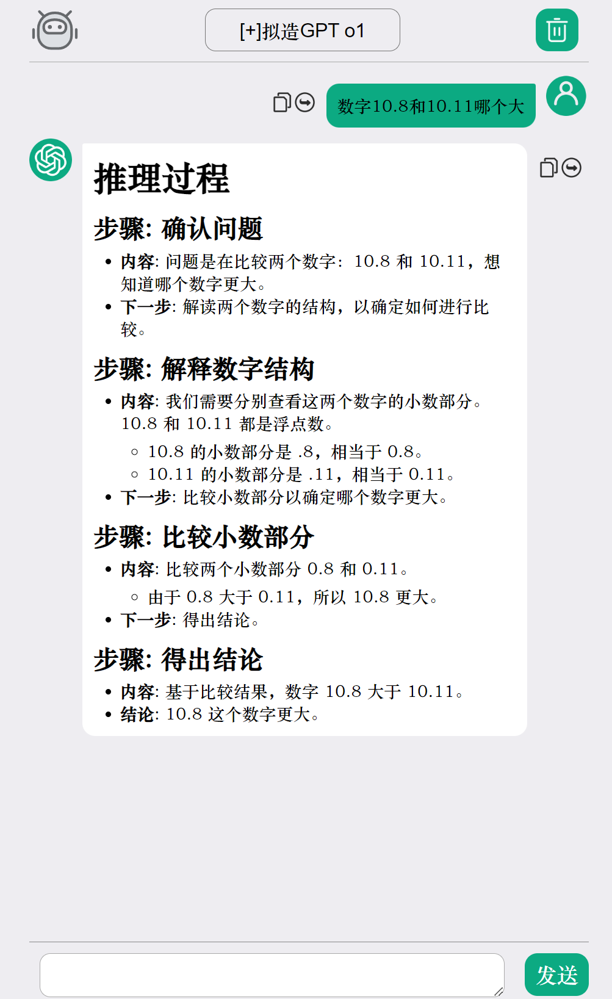

# Single-ChatGPT-Web

[](https://opensource.org/licenses/MIT)

[中文|[English](README-en.md)]

一个轻量级的单文件HTML版ChatGPT网页客户端，使用OpenAI API实现智能对话功能。

## 功能特性

- 简洁的聊天界面设计，支持连续对话上下文
- 仅88KB的超小单文件，零依赖部署（仅依赖字节跳动CDN的在线文件，渲染md和tex）
- 基于`marked.js`和`github-markdown.css`的Markdown格式渲染（字节跳动CDN）
- 基于MathJax的LaTeX公式渲染（字节跳动CDN）
- 使用base64编码图片，并嵌入到html文件中
- 针对Deepseek深度思考内容的显示适配
- 响应式布局（支持PC/手机访问）

## 更新日志

本仓库于2025-02-17在Github平台发布

**1.0**

> 2024-08-13
>
> 网页发布
>
> 网页支持使用markdown-it库进行Markdown渲染

**2.0**

> 2024-09-20
>
> 新增对多提示词的支持，修复部分Bug
>
> 优化网页整体布局

**3.0**

> 2025-02-17
>
> 新增对temperature的支持
>
> 新增对Deepseek-R1深度思考内容的显示支持（请使用支持reasoning_content的接口进行问答）
>
> 新增对LaTeX公式的渲染支持
>
> 修改markdown库为marked.js
>
> 修改CDN来源为字节跳动CDN。原有的jsDelivery无法在国内使用。

**4.0**

> 2025-02-24
>
> 新增对流式响应的支持
>
> 针对Deepseek-R1深度思考内容的流式显示支持
>
> 优化网页显示。

**5.0**

> 2025-02-25
>
> 新增对Mermaid图表的支持
>
> 更改markdown渲染库为markdown-it
>
> 修复部分流式响应bug

**5.1**

> 2025-02-27
>
> 修改Mermaid图表渲染，支持图表拖动
>
> 新增代码复制按钮
>
> 修复部分bug

## 快速开始

### 准备工作
#### 获取支持OpenAI官方协议的接口的BASE_URL和API_KEY

> 本项目不提供接口代理服务，如果需要使用OpenAI官方接口，请在自己的电脑挂梯子。

您需要获得如 `https://api.openai.com/v1/chat/comlpetions` 的BASE_URL和 `sk-xxxxxx` 的API_KEY。

然后根据下方的配置说明，对网页源代码进行修改。

如果您没有已有的第三方接口服务商，可以在[此处](Recommend_API_Server.md)查看作者本人推荐的服务商。

### 使用步骤
1. 克隆本仓库或下载`index.html`文件；

2. 在文本编辑器中打开`index.html`文件；

3. 对文件的配置进行修改，具体修改内容可参考后文“配置选项”部分；

4. 保存文件并通过以下方式之一运行：
- （推荐）直接双击打开（注意：如果API端点在本地，需要关闭浏览器CORS跨域限制）

- 使用Python的本地服务器提供到局域网访问（注意：允许Python通过防火墙）：
 ```bash
 python3 -m http.server 8000
 ```
 然后访问 `http://localhost:8000`

- 使用远程虚拟主机提供到公网的访问：

  - 将配置好的文件上传到远程虚拟主机
  - 配置解析域名、配置域名目录
  - 访问配置的域名以使用。

## 配置选项

在文件第9行，可修改的配置参数：

```javascript
// API配置
var api = "https://api.openai.com/v1/chat/completions"; // 您的api端点
var apikey = "sk-xxxxxxxxxxxxxxxxxxxxxxxxxxx"; // 您的api-key

var system_prompt = null; // 系统提示词，可留空
var temperature = 0.9 // 模型温度，越高模型的创造力就越高，输出越随机。此配置对Deepseek-R1无效。
var stream = false // 是否使用流式输出。
var llm_selection = [
    ["gpt-4o", "OpenAI GPT 4o"],
    ["first-prompt", "测试提示词"],
]; // API可用模型配置，每行第一个是模型代码，第二个是模型在下拉菜单中显示的内容。注意数组尾部逗号。

// 网页配置
var isinfo = 1;// 是否有开屏提示信息
var webFontFamily = "华文中宋, 微软雅黑, 楷体";// 网页全局字体，多个字体用英文逗号隔开，越靠前优先级越高

// 提示词配置
var test_prompt = "You are a helpful assistant.";
// 配置prompt，第一列是你为模型命的名（即llm_selection第一列的内容），第二列是真实使用的模型，第三列是提示词变量名。此处配置的提示词会覆盖system_prompt。
var prompt_model_list = [
    ["first-prompt", "gpt-4o", test_prompt],
]
```

## 常见问题

❓ **如何保存聊天记录？**  
当前版本不对记录进行任何本地存储，关闭浏览器、刷新页面都会丢失历史。
如果您需要导出历史记录，请按下F12打开浏览器调试工具，在“Console/控制台”里输入“historys”，按下回车，并复制返回的内容。

## 效果展示



